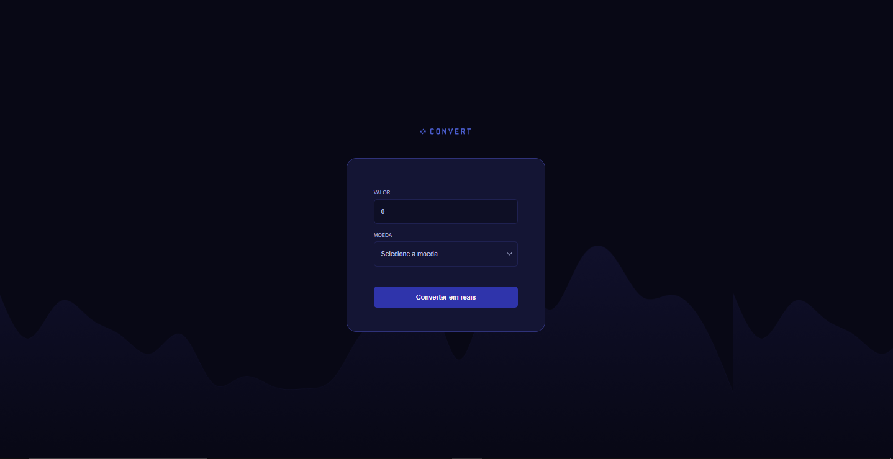
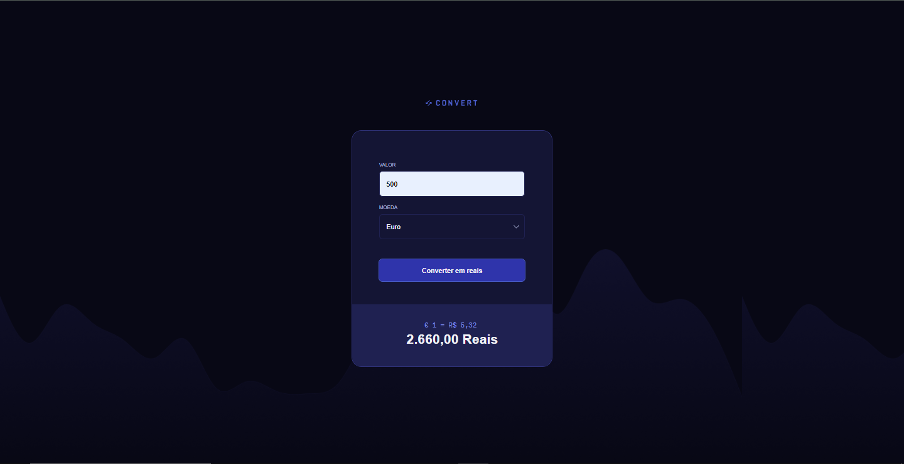

## Conversor de Moedas

Este projeto é um simples conversor de moedas que permite a conversão de valores de Dólares Americanos (USD), Euros (EUR) e Libras Esterlinas (GBP) para Reais (BRL). O projeto foi desenvolvido durante o curso da Rocketseat com o professor Rodrigo.

## Funcionalidades
Conversão de três moedas: USD, EUR e GBP.
Validação de entrada para garantir que apenas números sejam inseridos.
Exibição da taxa de câmbio atual entre as moedas.
Mensagens de erro informativas.

## Tecnologias Utilizadas
HTML
CSS
JavaScript

## Como Usar
Clone o repositório ou baixe os arquivos do projeto.
Abra o arquivo index.html em um navegador.
Insira o valor que deseja converter.
Selecione a moeda que deseja converter.
Clique em "Converter" para visualizar o resultado em Reais.

## Estrutura do Código
index.html: Contém a estrutura HTML do aplicativo.
script.js: Implementa a lógica de conversão de moedas.
style.css: Estiliza a interface do usuário.

## Exemplo de Uso
Ao inserir um valor em uma das moedas disponíveis e clicar no botão de conversão, o aplicativo exibirá o valor correspondente em Reais, junto com a taxa de câmbio atual.

## Contribuições
Sinta-se à vontade para enviar pull requests ou abrir issues se você encontrar problemas ou quiser sugerir melhorias!

## Licença
Este projeto é de uso livre.

Sinta-se à vontade para ajustar qualquer parte do texto!

